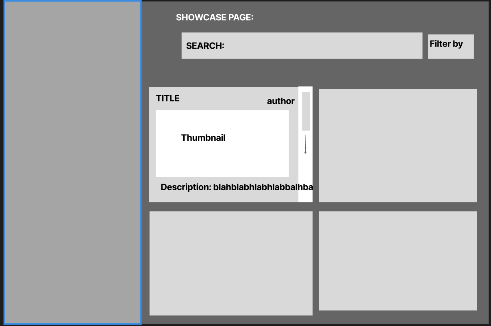
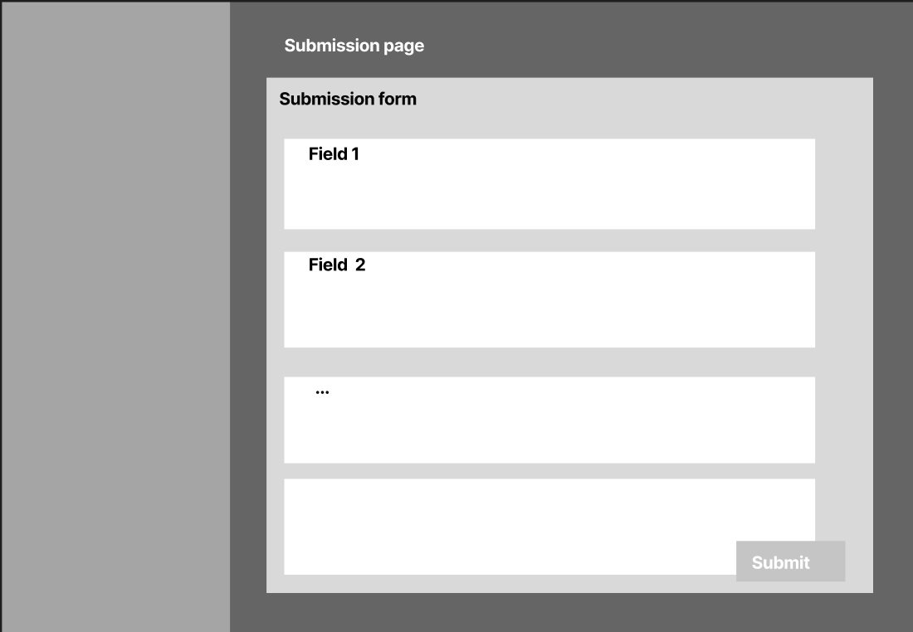
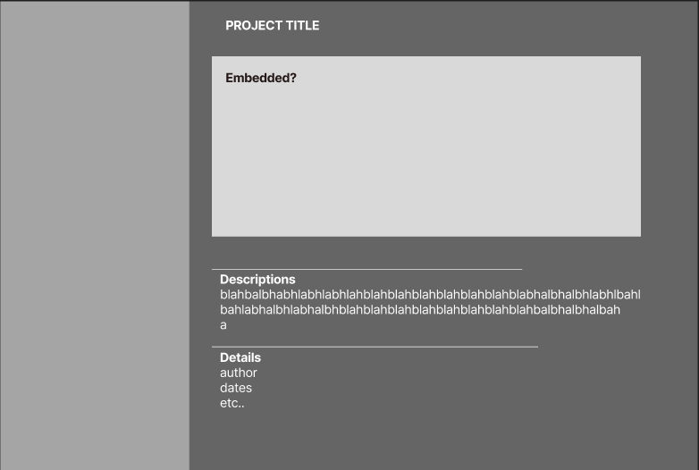
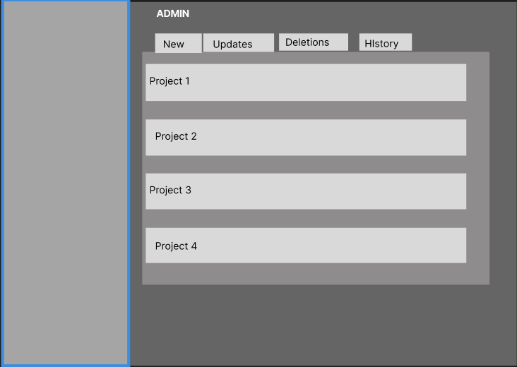

# Student Project Showcase Page Design Doc

**Team B5 Members:** [Ethan Crook](https://github.com/crookler), [Noah Weaver](https://github.com/noahweaves), [Avi Kumar](https://github.com/aviomg)

## Overview

Since the conversion of the CSXL space from a storage facility into the collaborative lab space that we see today, the CSXL has undoubtedly strengthened the community aspect of CS at UNC and has fostered many opportunities to reach out, work, and innovate within the confines of a safe space. At present, the CSXL website offers valuable regulation of the physical space and provides information about other possible spaces (like clubs and organizations) with which students can further engage to strengthen their involvement. With the Showcase page, we seek to highlight and expand upon this community aspect that the CSXL inspires, and we hope to forge an even stronger community both inside and outside of the physical space. The Showcase page consolidates the various other forms that students currently use to share accomplishments (such as Github and LinkedIn). This creates a single location where students can celebrate and plan with like-minded peers.

## Key Personas

1. **Ronald Random** can see the feed of project posts and is able to view further details about each of them. If Ronald attempts to create a new showcase post (or comment/upvote if this feature ends up being implemented), Ronald will be prompted to sign in using an Onyen.
2. **Sally Student** can see the same showcase post feed as Ronald but will have the option of creating new posts (and comment/upvote if implemented) and submitting them for moderator approval. Once approved, Sally and all other students will be able to view her post on the feed. Sally will further be able to delete and edit posts that she has already created.
3. **Amy Ambassador** has the ability to flag posts for review if they do not meet community guidelines. Has the ability to approve new posts to be displayed on the feed. Alternatively, Amy may have access to a staging screen where new posts are sent by students before being pushed to the main showcase feed (this option will depend on how much moderation is preferred).
4. **Rhonda Root** can manage the showcase feed by directly removing/editing/creating posts currently on the showcase feed regardless of authorship. Ronda will also have the same powers of moderation and oversight as Amy.

## User Stories

- As Ronald Random (and Sally Student), I want to be able to see posts in an expected reverse chronological order, and I want to be able to easily find the title, author, and date of each post.
- As Ronald Random (and Sally Student), I want to be able to click on the title or body of a specific post and be taken to a new page where the post is laid out fully.
- As Ronald Random (and Sally Student), I want to be able to search through the lists of posts based on specific titles, authors, or post tags like project type or used technologies
- As Sally Student, I want to have a separate create button and form where I can write my own post and then preview it before posting it.
- As Amy Ambassador, I want to see a list of staged posts with the option to either approve or disapprove them moving to the main list.
- As Amy Ambassador, I want to be able to preview the page in the same way that Sally or Ronald would see the page.
- As Rhonda Root, I want to have a clear list of all posts made to the showcase board with the option to freely edit or delete any post that I choose.
  As Rhonda Root, I want to have a clear list of all posts currently in the staging area (waiting for review) with the option to freely edit or delete any post that I choose.

## Wireframes

Basic Wireframe:
[Figma](https://www.figma.com/file/HaxP91uvVR3VTACBnGyhmE/Untitled?type=design&node-id=0-1&mode=design&t=mdPCDGMyLj8ZHHt0-0).

### Sally Student

This is the showcase page seen by Sally Student and Ronald Random.

This is the submission page that Sally will use to submit a new project draft for review.

This is the expanded project that Sally or Ronald will see after clicking on a specific project.

### Rhonda Root/Amy Ambassador

This is the review page that Amy will see to approve or disapprove incoming submissions.

## Technical Implementation Opportunities and Planning

**Existing Codebase—areas to depend on, extend, or integrate**

Dependencies:

- Users: When new posts are created, we’ll need to track the owner of the post and the users authorized to moderate posts
- Roles: Functionality will differ between roles. For example, a student should be able to view all approved/displayed posts and click on them to view details Additionally, a student should be able to access a form where they can submit a new post for approval. An ambassador should be able to do the same things as a student, as well as approve post requests, and flag posts for review if they don’t meet community guidelines. Finally, an admin should be able to do all the same things as an ambassador, as well as be able to manage and edit the showcase feed directly. (By extension, this means we also rely on the current auth system to know who can access/modify certain data)

Extensions:

- Entirely new database tables and data schemas will be required to store project information, but they will need to exist in a way to interact with and live on top of existing database information (especially users).
- Tables will likely include one for projects itself, which contains fields such as: Project ID, Project name, project author (which links/points to the user SQL table), project status (e.g. approved, pending approval, denied, deleted), and other various specified values regarding details of the project)

**Page Components and Widgets to Implement**

- Showcase page Component: Side-nav route accessible for all user stories. Displays page of “project” widgets, which are each small thumbnails giving an overview of each submitted and approved projects
- Project widget: small thumbnail widget displaying an overview of a submitted + approved project; displayed on the showcase page. Each widget also contains a route to a new page with a unique URL that displays the entire post itself (rather than just a thumbnail)...similar concept as YouTube UI
- Project display page Component: routed through each project widget on the Showcase Component. Each project display page has a unique URL (i.e., the project ID)
- Project Submission Page Component: Side-nav route accessible for all user stories. Displays a form to submit a request for a new project that a user wants to create. User enters all details about their post here (and this is the data that gets stored in the project entity). Inherently, will also need a project submission form service to handle submissions.
- Stretch Goal: Possibility to create different components for different types of projects, in order to manage how we want them to be displayed (e.g., HTML websites v.s. github repositories, etc)
- Showcase edit/review page: side-nav route accessible only to user stories who are logged in as ambassadors or administrators. Contains widgets of projects as well as their status—approved, pending approval, denied approval, etc. Contains 4 columns: column of approved posts, pending approved posts, deleted posts, and post history. Contains functionality to actually approve and display a new widget on the showcase page
- Stretch Goal: Project editing form Component and subsequence service: lets people request updates to their projects as well as request to delete them

**Models to Implement**

- Update the “User” model and entity to add a field regarding info about posts that a user authored.
- Create a new “Project” model, which includes details as well as status of a project

**API / Routes to Implement**

- User API/service: update functionality to add all of the details regarding accessibility and security
- Routes for new component pages described above

**Security and Privacy concerns**

- Any new project post submissions will have to go through moderator approval/review before they can be displayed on the Showcase component
- Rhonda Root is the only user who is able to directly edit the Showcase component page to remove or edit project widgets
- Amy Ambassador (and all XL Ambassadors) as well as Rhonda Root can review and approve project submissions on the Showcase edit/review Component page
